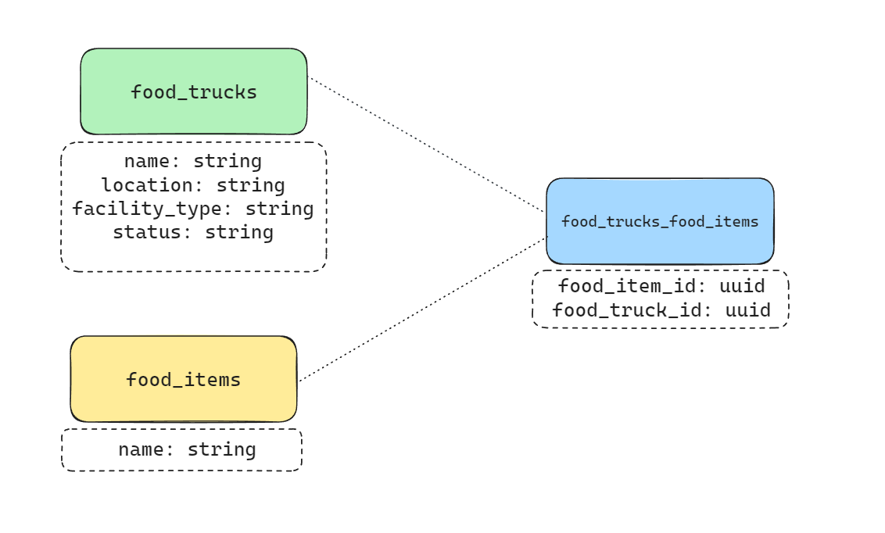
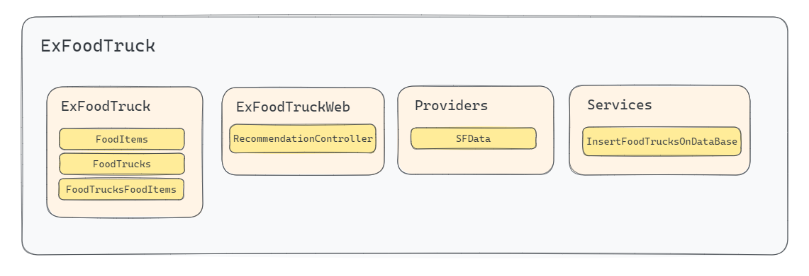
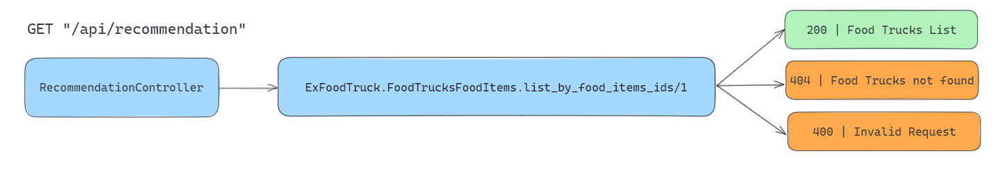
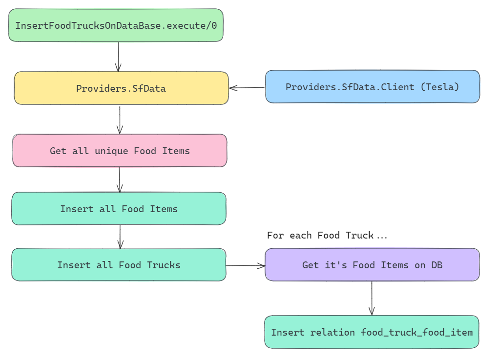

# ExFoodTruck - Discover which Food Trucks of San Francisco are recommended to you

### Setup Application

There are two options to start the service: using Docker containers or running it manually on the machine. The Docker solution is more advantageous because it includes the database, eliminating the need for a separate database setup.

#### Docker Container

To set up using Docker, navigate to the repository directory and execute the following command:

```bash
$ docker-compose up
```

The necessary images will be downloaded, the application will go through the image build process, and then the application will be available at `localhost:4000`.

#### Phoenix Server (locally)

To run the service manually on your machine, you need to have the following installed:

- Elixir - 1.14.5
- Erlang - OTP24

It is common to use `asdf` to manage the versions of these components.

To start your Phoenix server:

1. Run `mix setup` to install and set up dependencies.
2. Start the Phoenix endpoint with `iex -S mix phx.server`.

Now you can visit `localhost:4000` from your browser.

### Application Data

When the app starts to run, all migrations and seeds are executed automatically through the setup scripts. The service `Services.InsertFoodTrucksOnDataBase` runs, processing and importing San Francisco's database data into the service database. Once this process is completed, the service is ready to be used.

### Tests

The application's unit tests can be executed within the directory using:

```bash
$ mix test
```

## How to use the Service

This service consists of a GET endpoint that receives food types and returns food trucks that offer these foods.

### API Request

This endpoint makes an HTTP GET request to localhost:4000/api/recommendation to retrieve recommendations based on the provided food items.

#### Route

- `/api/recommendation`

#### Request Body

- No request body is required for this request.

#### Query Parameters

- **food_items[]** (array) - The array of food items for which recommendations are requested.

### API Response

The response to this request is a JSON array with the following schema:

JSON

```json
[
  {
    "food_item": "string",
    "food_truck": {
      "id": "string",
      "name": "string",
      "status": "string",
      "location": "string",
      "facility_type": "string"
    }
  }
]
```

- **food_item** (string) - The recommended food item.
- **food_truck** (object) - Information about the recommended food truck.

  - **id** (string) - The unique identifier of the food truck.
  - **name** (string) - The name of the food truck.
  - **status** (string) - The status of the food truck.
  - **location** (string) - The location of the food truck.
  - **facility_type** (string) - The type of facility provided by the food truck.

### Import to Postman

```curl
curl --location --globoff 'localhost:4000/api/recommendation?food_items[]=eggs&food_items[]=salads'
```

## About the project

This project was designed as a simple way to represent a recommendation system for Food Trucks in San Francisco, based on the types of foods they offer. The service provides an endpoint that can receive different types of foods through query parameters, returning all the Food Trucks in San Francisco that offer any dish with the foods sent via parameters.

### Data relation

The information to ensure the service's functionality was organized to optimize the search for Food Trucks based on the types of foods they offer. Three relationships were necessary to store the information:


### Service Design

The application is simple and contains only a few modules to organize database information, communicate with the data provider, and a service to import this data, along with tests and project configuration files. The contexts were organized as follows:


#### Recommendation Endpoint

The recommendation endpoint uses the data organized in the database to search, through the provided food names, for which Food Truck recommendations it can give. The system modules communicate as follows:


#### Importing Food Truck Information

The information about San Francisco's Food Trucks is made available through an open API, accessible to anyone. To bring this data into the service, a module was created to fetch and insert this information into the ExFoodTruck database. The information is retrieved via a GET request to San Francisco's open API, processed to fit the application's schemas, and finally inserted, respecting the relationships between the tables in the database. The communication between contexts works as follows:


### Reasons behind the decisions:

Several factors related to the way data is made available influenced my decisions in building this project.

- **Which information provided by the platform could be useful to me? What value could I deliver simply with the obtained information?**
  I decided to use the `food_items` column to create a database with all the types of food that the listed Food Trucks were offering. This required the creation of a script (`InsertFoodTrucksOnDataBase`), responsible for fetching this data through an integration with the San Francisco data platform. This integration retrieves and processes the information from the platform, allowing the service to insert the data into the application's database, respecting the relationships between tables.

- **To enable grouping and filtering of Food Trucks, I created a table that relates Food Trucks to Food Items.**
  Each Food Item that a Food Truck offers is stored in this relationship. This way, only one function is needed to fetch this information according to the passed parameters.

- **Even though the data is available in CSV format, the San Francisco data platform provides the same information through an API.**
  This means we don't need to work with file import to have this information in our database.

- **Docker is fast to deploy**
  Docker was chosen because it is the simplest way to deploy a solution to production. Since a database is needed, using Docker eliminates the need for the user to install PostgreSQL, Elixir, and Erlang.

### What more could be done?

- **Authentication System for the API (JWT, BasicAuth...)**
- **Create an Oban Job to trigger the execution of the `InsertFoodTrucksOnDataBase` service**
  This would ensure that in cases of errors or infrastructure instability, one or more automatic retries would be performed.
- **Enable deploying the service using Kubernetes**
  This would increase the service's reliability against failures.
- **Use ExMachina instead of fixtures**
  Some of the Schemas were generated by `mix phx.gen.contexts`, some tests are created and they use fixtures. ExMachina provides a more dynamic way to create data for the tests.

### New Features:

- **Persist users and their preferences**
- **Create a cron job that checks for updates in the Food Trucks list and updates the records in the database.**
- **Allow recommendation filtering using other Food Truck information**
  Example: Location (provide the nearest food trucks based on user preferences).
